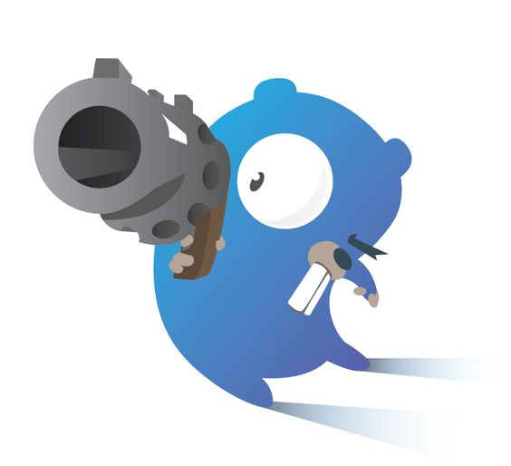

<!-- PROJECT LOGO -->
<br />
<p align="center">
  <a href="https://github.com/jarlex/gommander">
    
  </a>
  <h3 align="center">GoMMander</h3>
</p>

<!-- TABLE OF CONTENTS -->
## Table of Contents

* [About the Project](#about-the-project)
  * [Built With](#built-with)
  * [Dependencies](#dependencies)
* [Getting Started](#getting-started)
  * [Prerequisites](#prerequisites)
  * [Installation](#installation)
* [Usage](#usage)
* [Roadmap](#roadmap)
* [Contributing](#contributing)
* [License](#license)
* [Contact](#contact)
* [Acknowledgements](#acknowledgements)


<!-- ABOUT THE PROJECT -->
## About The Project
GoMMander is a Go HTTP command that can test an API and make stress test.

You can use gommander for automatize HTTP request. 

### Built With
We use Golang as the base language and docker images are provided for deployment.

Use go mod as dependencies manager.

### Dependencies
TBD


<!-- GETTING STARTED -->
## Getting Started
```bash
#Installation by source
go get github.com/jarlex/gommander
cd $GO_PATH/github.com/jarlex/gommander
./build.sh

#Download image
docker pull #TBD
```

### Prerequisites
* Golang 1.12.5

### Installation
TBD

<!-- USAGE EXAMPLES -->
## Usage
TBD

<!-- ROADMAP -->
## Roadmap
TBD

<!-- CONTRIBUTING -->
## Contributing

Contributions are what make the open source community such an amazing place to be learn, inspire, and create. Any contributions you make are **greatly appreciated**.

1. Fork the Project
2. Create your Feature Branch (`git checkout -b feature/AmazingFeature`)
3. Commit your Changes (`git commit -m 'Add some AmazingFeature'`)
4. Push to the Branch (`git push origin feature/AmazingFeature`)
5. Open a Pull Request


<!-- LICENSE -->
## License
Distributed under the MIT License. See `LICENSE` for more information.


<!-- CONTACT -->
## Contact
TBD

<!-- ACKNOWLEDGEMENTS -->
## Acknowledgements
TBD